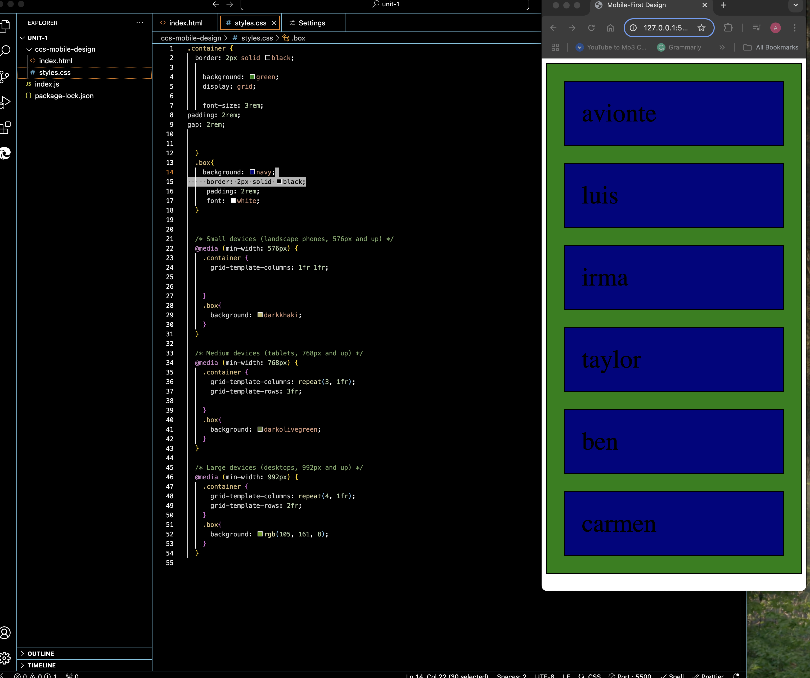
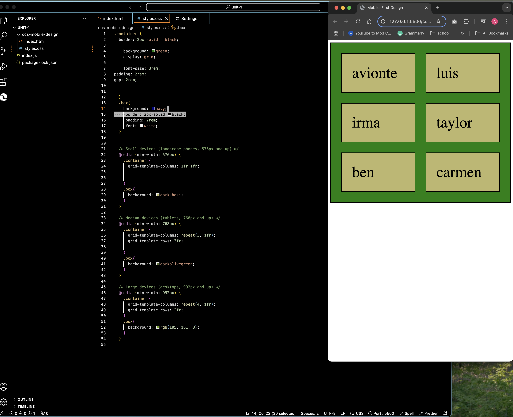
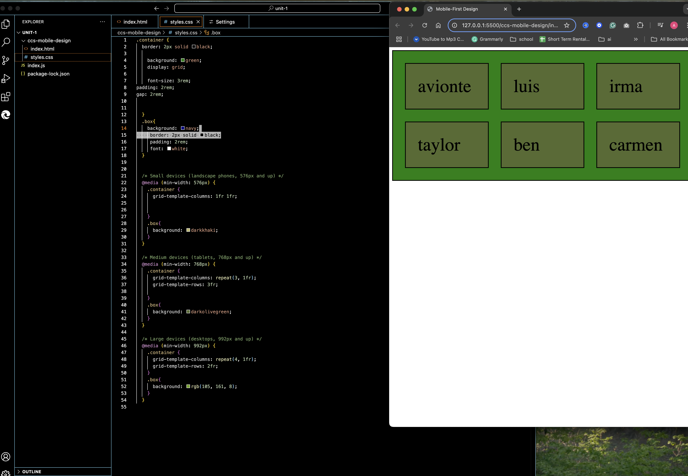

# Technical Writing Assignment

For guidance on setting up and submitting this assignment, refer to the Marcy lab School Docs How-To guide for [Working with Short Response and Coding Assignments](https://marcylabschool.gitbook.io/marcy-lab-school-docs/fullstack-curriculum/how-tos/working-with-assignments#how-to-work-on-assignments).

## Prompt 1

What are the main differences between Flexbox and Grid layouts? Describe scenarios where each layout system would be more suitable.

### Response 1

**Flexbox** and **Grid Layouts** are two ways to position elements in a CSS container.

- **Flexbox** arranges the elements in rows or columns if set using `flex-direction`. **Flexbox** is most useful when dealing with content elements you want to move on one axis making it one dimension. **Flexbox** would be great for a simple navigation bar.
- **Grid Layouts** arrange the elements in a grid using both rows and columns simultaneously. It lets you spread the aspects across the given space. **Grid layouts** would work great for complex media layouts.

## Prompt 2

What is the difference between `justify-content` and `align-items` in Flexbox? How does each property control the positioning of flex items within the container?

### Response 2

The main difference between `justify-content` and `align-items` is the axis that they manipulate items on. `justify-content` can move items along the horizontal axis while `align-items ` does so on the vertical axis

## Prompt 3

Describe the difference between `grid-template-areas` and `grid-template-columns`/`grid-template-rows`. When might you prefer one approach over the other?

### Response 3

The `grid-template-areas` is a CSS property that creates cells that represent your area using the grid item's name. The `grid-template-rows` and `grid-template-columns` are CSS properties that determine the number of rows/columns and size in the container.

- I would prefer to use a grid-template-area when creating a website because you can place your `header`, `footer`, `body`, etc. in a specific format. Unlike `grid-template-rows` and `grid-template-columns` which give your format a less _dynamic_ layout.

## Prompt 4

Explain the `min-width` and `max-width` keywords in media queries. How do they help create responsive breakpoints for different screen sizes?

### Response 4

The `min-width` and `max-width` keywords determine the **outer limits** of the given element in regards to it's **size**. `min-width` will put a limit on how **small** and item can get while `max-width` will set a limit on how **big** that item can appear.

- These keywords give us a **range** of space that our items to take up, so as the size of our screen becomes **larger** (take for example a laptop screen), the elements can approach their _upper limit_ aka the `max-width`.

- Inversely, as our screen gets **smaller** (like a phone screen), the elements can approach their _lower limit_ aka the `min-width`. As long as there's sufficient space, the elements size should **dynamically** move between the range of our `min-width` and `max-width`.

## Prompt 5

Imagine you are teaching a brief lesson on **mobile first design**. Your lesson should include the following information:

- An explanation of mobile first design and a few of the benefits of this approach
- A CSS code example demonstrating how to use media queries to adjust the layout of a container from mobile to desktop with either Flexbox or Grid (choose one).
- An explanation of the code example.

### Response 5

Lyft, uber, esty, and Huffington Post are all websites with **mobile-first designs**. Mobile-first design is a website design strategy that prioritizes mobile device display first and then larger screens using media queries. Mobile-first design benefits the responsiveness of the website for different size screens. It also improves the user's experience with the dynamic formatting.

```ccs
.container {
    border: 2px solid black;
    background: green;
    display: grid;

    font-size: 3rem;
    padding: 2rem;
    gap: 2rem;

 }
 .box{
    background: navy;
    border: 2px solid black;
    padding: 2rem;
    font: white;
 }
/* Small devices (landscape phones) */
 @media (min-width: 576px) {
   .container {
     grid-template-columns: 1fr 1fr;
   }
   .box{
     background: darkkhaki;
   }
 }
  /* Medium devices (tablets, 768px and up) */
 @media (min-width: 768px) {
   .container {
     grid-template-columns: repeat(3, 1fr);

   }
.box{
     background: darkolivegreen;
   }
 }
  /* Large devices (desktops) */
 @media (min-width: 992px) {
   .container {
     grid-template-columns: repeat(4, 1fr);

   }
   .box{
     background: rgb(105, 161, 8);
   }
 }

```

The code snippet above demonstrates how to use the `grid-template` property to create a mobile-first CSS website design. The layout consists of six boxes, each containing a name. Initially, the boxes are displayed in a single column with a blue background color, as this design works best for mobile devices. This is achieved using media queries (`@media`) and the `min-width` property. When the specified pixel width is reached, the CSS rules inside the media query are applied.

In the example provided:

- **Screens smaller than 576 pixels** display the boxes in a single column with a blue background.
  
- **Small devices** (screens wider than 576 pixels) display the boxes in two columns with a beige background.
  
- **Medium screens** (screens wider than 768 pixels, like tablets) display the boxes in three columns with a green background.
  
- **Large screens** (screens wider than 992 pixels, like desktops) display the boxes in four columns with a light green background.
  
